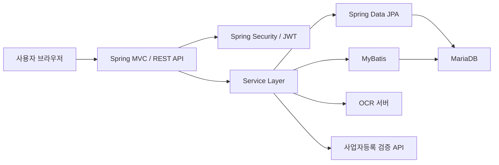

 # Kosta ERP Server

소규모 음식점의 식자재 재고, 메뉴, 매출, 폐기 및 알림을 통합 관리하는
Spring Boot 기반 ERP 웹 애플리케이션입니다.

## 주요 기능

| 기능 | 설명 |
| --- | --- |
| 인증 및 회원관리 | JWT 로그인, 토큰 재발급, 로그아웃, 휴대전화 인증 |
| 가입 심사 | 사업자등록증 OCR 검증 및 관리자 승인·반려 |
| 식자재 관리 | 식자재 및 카테고리 등록, 검색, 삭제 |
| 메뉴 관리 | 메뉴·메뉴 카테고리 등록 및 재료 연결 |
| 매출 관리 | 판매 등록, 조회, 수정, 삭제 |
| 발주·폐기 관리 | 발주 내역과 폐기 식자재 관리 |
| 재고 알림 | 품절 및 유통기한 임박 알림 |
| 통계 | 매출·지출·폐기율·메뉴 판매 순위 시각화 |

## 기술 스택

### Backend

- Java 17
- Spring Boot 3.5.14
- Spring MVC
- Spring Security
- Spring Data JPA
- MyBatis 3.0.5
- JWT

### Frontend

- Thymeleaf
- JavaScript
- HTML/CSS

### Database & Infrastructure

- MariaDB
- Maven
- Docker
- Springdoc OpenAPI 2.8.17

## 시스템 구조


## 패키지 구조
```
src/main/java/com/oopsw/kostaerpserver
├── advice       # MVC 및 REST 컨트롤러, 예외 처리
├── auth         # 인증·인가 및 JWT
├── dto          # API 요청·응답 객체
├── repository   # JPA Repository, Entity, MyBatis DAO
├── service      # 비즈니스 로직
└── vo           # 화면 및 데이터 전달 객체
```
