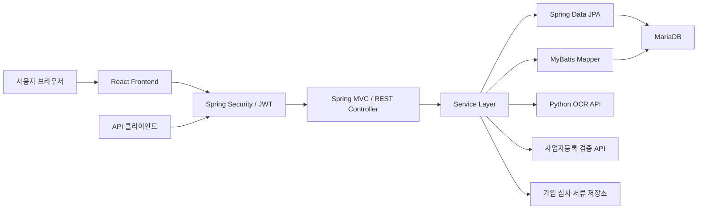

# Kosta ERP Server


소규모 음식점의 식자재 재고, 메뉴, 매출, 발주, 폐기 및 알림을 하나의 흐름으로 관리하는 ERP 서비스의 백엔드 애플리케이션입니다. Spring Boot REST API를 제공하며, React 프런트엔드와 연동합니다. JWT 인증과 사업자등록증 OCR 기반 회원가입 심사를 지원합니다.

> 현재 개발 단계의 프로젝트입니다. 운영 환경에 배포하기 전에는 [운영 전 확인 사항](#운영-전-확인-사항)을 반드시 검토하세요.

## 목차

- [주요 기능](#주요-기능)
- [서비스 구조](#서비스-구조)
- [기술 스택](#기술-스택)
- [시작하기](#시작하기)
- [Docker로 실행하기](#docker로-실행하기)
- [인증 방식](#인증-방식)
- [API 요약](#api-요약)
- [프로젝트 구조](#프로젝트-구조)
- [설정 상세](#설정-상세)
- [빌드와 테스트](#빌드와-테스트)
- [문제 해결](#문제-해결)
- [운영 전 확인 사항](#운영-전-확인-사항)

## 주요 기능

| 기능 | 설명 |
| --- | --- |
| 인증 및 회원 관리 | 사업자등록번호 기반 로그인, JWT 발급·재발급·로그아웃, BCrypt 비밀번호 암호화 |
| 휴대전화 인증 | 회원가입 전 인증번호 발급 및 검증. 현재 구현은 SMS 대신 서버 로그에 인증번호 출력 |
| 가입 심사 | 사업자등록증 OCR, 사업자 정보 검증, 자동 승인 또는 관리자 수동 승인·반려 |
| 식자재 관리 | 식자재·카테고리 등록, 검색, 정렬, 페이징, 삭제 및 재고 관리 |
| 메뉴 관리 | 메뉴·메뉴 카테고리 등록, 메뉴별 사용 식자재 연결, 판매 시 재고 차감 |
| 매출 관리 | 판매 등록, 기간·카테고리·메뉴·결제수단별 검색, 수정 및 삭제 |
| 발주·폐기 관리 | 발주 내역 조회, 폐기 식자재 등록, 폐기 사유 변경 및 재고 반영 |
| 재고 알림 | 품절 알림, 유통기한 임박 알림, 읽음 처리 및 알림 설정 |
| 통계 | 매출·지출·폐기율·폐기 사유·메뉴 판매 순위·월별 추이 조회 |
| API 문서 | Springdoc OpenAPI와 Swagger UI를 통한 API 탐색 및 호출 |

## 서비스 구조



React 프런트엔드는 사용자 화면과 상태를 관리하고 이 서버의 REST API를 호출합니다. 백엔드는 인증·인가, 비즈니스 로직, 외부 서비스 연동과 데이터 처리를 담당하며, 데이터 접근에는 도메인에 따라 Spring Data JPA와 MyBatis를 혼용합니다.

## 기술 스택

### Backend

- Java 17
- Spring Boot 3.5.14
- Spring MVC
- Spring Security
- Spring Data JPA
- MyBatis Spring Boot Starter 3.0.5
- Auth0 Java JWT 4.4.0
- Springdoc OpenAPI 2.8.17
- Lombok

### Frontend

- React
- JavaScript
- HTML / CSS

> 프런트엔드는 별도 React 프로젝트로 관리합니다. 이 저장소는 백엔드 서버를 기준으로 설명합니다.

### Database & Infrastructure

- MariaDB
- Maven Wrapper 3.3.4
- Apache Maven 3.9.15
- Docker multi-stage build
- Eclipse Temurin 21 JDK/JRE 컨테이너 이미지

> `pom.xml`의 컴파일 기준은 Java 17이고, Docker 빌드·실행 이미지는 Java 21입니다. 로컬 개발에는 JDK 17 이상을 사용하면 됩니다.

## 시작하기

### 1. 사전 요구사항

로컬 실행에 필요한 항목은 다음과 같습니다.

- JDK 17 이상
- MariaDB와 애플리케이션용 데이터베이스
- Git
- 최초 Maven Wrapper 실행 시 의존성을 내려받기 위한 네트워크 연결
- 선택 사항: Docker
- 회원가입 자동 검증을 사용할 경우 Python OCR API와 사업자등록 검증 API

Maven은 별도로 설치하지 않아도 됩니다. 저장소에 포함된 `mvnw` 또는 `mvnw.cmd`가 지정된 Maven 버전을 내려받아 실행합니다.

### 2. 저장소 받기

```bash
git clone https://github.com/goldenpage/KostaErpServer.git
cd KostaErpServer
```

현재 저장소의 `mvnw`에는 실행 권한이 기록되어 있지 않으므로 macOS/Linux에서는 한 번 권한을 부여합니다.

```bash
chmod +x mvnw
```

### 3. 실행 설정 준비

애플리케이션 실행에는 데이터베이스 스키마, 초기 데이터, 인증 설정 및 연동 서비스 설정이 필요합니다. 보안을 위해 구체적인 설정 항목과 값은 README에 기록하지 않습니다.

- 개발·테스트 환경의 설정 파일과 계정은 프로젝트 관리자에게 별도로 전달받으세요.
- 전달받은 설정 파일은 Git에 추가하지 마세요.
- 현재 저장소에는 전체 DB 마이그레이션과 초기 데이터가 포함되어 있지 않으므로 팀에서 관리하는 스키마를 먼저 적용해야 합니다.
- 운영 설정은 조직의 Secret 관리 도구와 배포 파이프라인을 통해 주입하세요.

### 4. 애플리케이션 실행

macOS/Linux:

```bash
./mvnw spring-boot:run
```

Windows:

```powershell
.\mvnw.cmd spring-boot:run
```

React 프런트엔드의 실행과 백엔드 연결 설정은 해당 프런트엔드 저장소의 문서 및 내부 개발 지침을 따르세요.

## Docker로 실행하기

### 이미지 빌드

Dockerfile 이름이 소문자 `dockerfile`이므로 `-f` 옵션을 지정합니다.

```bash
docker build -f dockerfile -t kosta-erp-server:local .
```

### 실행 설정 준비

프로젝트 관리자에게 전달받은 승인된 컨테이너 실행 설정을 사용하세요. 구체적인 설정 이름과 값은 공개 README에 포함하지 않습니다.

### 컨테이너 실행

다음 명령에서 `<approved-runtime-config-file>`을 내부에서 전달받은 설정 파일 경로로 교체합니다. 포트 매핑, 영속 데이터 볼륨과 네트워크 구성은 공개 문서에 기록하지 않으며 배포 환경의 내부 운영 지침을 따릅니다.

```bash
docker run --rm \
  --name kosta-erp-server \
  --env-file <approved-runtime-config-file> \
  kosta-erp-server:local
```

## 인증 방식

애플리케이션은 서버 세션에 Security Context를 저장하지 않는 JWT 기반 인증을 사용합니다.

### 로그인

`POST /api/auth/login`

```json
{
  "username": "<issued-account>",
  "password": "<password>"
}
```

로그인 성공 시 Access Token과 Refresh Token이 발급됩니다.

- Access Token은 보호된 API 요청의 `Authorization` 헤더에 사용합니다.
- Refresh Token은 클라이언트 스크립트에서 직접 읽을 수 없는 쿠키로 관리합니다.
- 토큰 만료 정책과 쿠키 세부 설정은 배포 환경의 보안 정책을 따릅니다.

보호된 API를 호출할 때 Access Token을 요청 헤더에 넣습니다.

```bash
curl -H 'Authorization: Bearer <access-token>' \
  <backend-base-url>/api/foodmaterials
```

Swagger UI의 **Authorize** 대화상자에는 일반적으로 `Bearer ` 접두사 없이 토큰 값만 입력하면 됩니다.

### 토큰 재발급과 로그아웃

| Method | Endpoint | 설명 |
| --- | --- | --- |
| `POST` | `/api/auth/reissue` | Refresh Token 쿠키로 새 Access/Refresh Token 발급 |
| `POST` | `/api/auth/logout` | 저장된 Refresh Token 무효화 및 쿠키 삭제 |

API 클라이언트는 위 요청에서 발급받은 인증 쿠키를 함께 보내야 합니다. 토큰이 만료되었거나 유효하지 않으면 다시 인증하거나 토큰 재발급 절차를 수행하세요.

### 회원가입과 휴대전화 인증

회원가입 흐름은 다음 순서입니다.

1. `POST /api/auth/phone/code`로 인증번호를 요청합니다.
2. 현재 개발 구현에서는 SMS가 아니라 애플리케이션 로그에서 인증번호를 확인합니다.
3. `POST /api/auth/phone/verify`로 인증번호를 검증합니다.
4. 같은 HTTP 세션을 유지한 채 `POST /api/auth/register`를 호출합니다.
5. OCR 및 사업자 정보 검증 결과에 따라 `APPROVED`, `PENDING`, `REJECTED`, `RETRY` 상태가 반환됩니다.

휴대전화 인증 상태는 HTTP Session에 저장되므로, 브라우저가 아닌 API 클라이언트는 인증번호 요청부터 회원가입까지 같은 세션을 유지해야 합니다.

회원가입 API는 `multipart/form-data`를 사용합니다.

- `request`: 회원가입 정보를 담은 JSON Part
- `document`: 사업자등록증 파일 Part
- 허용 형식: PDF, JPG, PNG
- 회원가입 검증 단계의 최대 파일 크기: 5MB
- 전체 애플리케이션 업로드 제한: 파일 10MB, 요청 11MB

OCR 판독이 어렵거나 외부 검증 서버 호출에 실패하면 신청 정보와 서류가 저장되고 관리자 심사 `PENDING` 상태로 전환됩니다.

## API 요약

세부 Query Parameter, Request Body, Response Schema는 배포 환경에서 제공되는 Swagger UI에서 확인하는 것이 가장 정확합니다. 접속 주소는 프로젝트 관리자에게 별도로 확인하세요.

| 영역 | Method / Endpoint | 현재 접근 범위 | 설명 |
| --- | --- | --- | --- |
| 인증 | `POST /api/auth/login` | 공개 | 로그인 및 JWT 발급 |
| 인증 | `POST /api/auth/reissue`, `POST /api/auth/logout` | 공개 | 토큰 재발급, 로그아웃 |
| 회원가입 | `POST /api/auth/phone/code`, `POST /api/auth/phone/verify`, `POST /api/auth/register` | 공개 | 휴대전화 인증과 사업자 가입 신청 |
| 사용자 | `GET /api/auth/userinfo` | 로그인 | 로그인 사용자 이름과 역할 조회 |
| 가입 심사 | `GET /api/manager/registration-reviews` | `ROLE_MANAGER` | 상태별 가입 신청 목록 조회 |
| 가입 심사 | `GET /api/manager/registration-reviews/{reviewId}` | `ROLE_MANAGER` | 신청 상세 조회 |
| 가입 심사 | `GET /api/manager/registration-reviews/{reviewId}/document` | `ROLE_MANAGER` | 제출 서류 열람 |
| 가입 심사 | `POST /api/manager/registration-reviews/{reviewId}/approve` | `ROLE_MANAGER` | 가입 승인 |
| 가입 심사 | `POST /api/manager/registration-reviews/{reviewId}/reject` | `ROLE_MANAGER` | 가입 반려 |
| 식자재 | `GET /api/foodmaterials`, `DELETE /api/foodmaterials/{foodMaterialId}` | 로그인 | 식자재 목록·검색·페이징 및 삭제 |
| 식자재 등록 | `GET /api/foodmaterial/foodcategory/list` | 로그인 | 식자재 카테고리 목록 |
| 식자재 등록 | `POST /api/foodmaterial/foodcategory/add`, `DELETE /api/foodmaterial/foodcategory/delete` | 로그인 | 식자재 카테고리 추가·삭제 |
| 식자재 등록 | `GET /api/foodmaterial/search/add/{foodMaterialName}`, `POST /api/foodmaterial/add` | 로그인 | 식자재 검색 및 등록 |
| 메뉴 | `GET /api/menus`, `GET /api/menus/{menuId}` | 로그인 | 메뉴 목록과 상세 조회 |
| 메뉴 | `GET /api/menus/{menuId}/materials` | 로그인 | 메뉴별 사용 식자재 조회 |
| 메뉴 | `POST /api/menus/{menuId}/sales`, `DELETE /api/menus/{menuId}` | 로그인 | 메뉴 판매 처리 및 삭제 |
| 메뉴 등록 | `/api/menu/menucategory/*`, `/api/menu/foodmaterial/list`, `POST /api/menu/add` | 로그인 | 메뉴 카테고리·재료 조회 및 메뉴 등록 |
| 매출 | `GET /api/sales/search`, `GET /api/sales/list`, `GET /api/sales/{id}` | 정책 확인 | 매출 검색·목록·상세 조회 |
| 매출 | `POST /api/sales`, `PUT /api/sales/update/{id}`, `DELETE /api/sales/delete/{id}` | 정책 확인 | 매출 등록·수정·삭제 |
| 발주 | `GET /api/purchase` | 로그인 | 로그인 사업자의 발주 목록 조회 |
| 폐기 | `GET /api/disposal-items`, `GET /api/disposal-items/filters` | 로그인 | 폐기 목록·필터 조회 |
| 폐기 | `POST /api/disposal-items`, `PATCH /api/disposal-items/{id}/reason` | 로그인 | 폐기 등록 및 사유 변경 |
| 폐기 알림 | `GET /api/notice` 및 `/api/notice/*` 조회·읽음 API | 로그인 | 폐기·기한 관련 요약과 읽음 처리 |
| 알림 설정 | `GET/PATCH /api/notice/exp`, `GET/PATCH /api/notice/stock` | 로그인 | 유통기한·재고 알림 설정 |
| 유통기한 알림 | `GET /api/expiration-notice`, `GET /api/expiration-notice/count` | 로그인 | 유통기한 임박 목록·개수 조회 |
| 품절 알림 | `GET /api/out-of-stock-notice`, `GET /api/out-of-stock-notice/count` | 로그인 | 미확인 품절 알림 조회 |
| 품절 알림 | `PATCH /api/out-of-stock-notice/{noticeId}/read`, `PATCH /api/out-of-stock-notice/read-all` | 로그인 | 개별·전체 읽음 처리 |
| 통계 | `GET /api/statistics/disposals/*` | 로그인 | 폐기율, 금액, 상위 식자재, 사유 비율, 일별 추이 |
| 통계 | `GET /api/statistics/revenue/*` | 로그인 | 총매출, 이력, 메뉴 순위, 월별 매출 |
| 통계 | `GET /api/statistics/expenses/*` | 로그인 | 총지출, 식자재 순위, 월별 지출 |

### 공통 예외 응답

REST API 처리 중 공통 예외가 발생하면 다음 형태의 JSON이 반환됩니다.

```json
{
  "message": "오류 설명"
}
```

| HTTP 상태 | 대표 상황 |
| --- | --- |
| `400 Bad Request` | 필수 값 누락, 잘못된 요청 형식, 허용되지 않은 파일 |
| `401 Unauthorized` | 인증 누락, 만료 또는 잘못된 Access Token |
| `409 Conflict` | 처리 상태 충돌, 데이터 중복·무결성 오류 |
| `413 Payload Too Large` | 전체 업로드 크기 제한 초과 |
| `500 Internal Server Error` | 처리되지 않은 서버 오류 |

## 프로젝트 구조

```text
KostaErpServer/
├── .mvn/wrapper/                 # Maven Wrapper 설정
├── src/
│   ├── main/
│   │   ├── java/com/oopsw/kostaerpserver/
│   │   │   ├── advice/
│   │   │   │   └── restcontroller/ # REST API Controller
│   │   │   ├── auth/            # Security, JWT, 사용자 인증
│   │   │   ├── dto/             # 요청·응답 DTO
│   │   │   ├── repository/
│   │   │   │   ├── dao/         # MyBatis DAO
│   │   │   │   └── entity/      # JPA Entity와 Repository
│   │   │   ├── service/         # 비즈니스 로직과 외부 API Client
│   │   │   └── vo/              # MyBatis·화면용 Value Object
│   │   └── resources/
│   │       ├── mappers/          # MyBatis XML Mapper
│   │       └── application.yaml  # 애플리케이션 설정
│   └── test/                     # Spring Boot 테스트
├── dockerfile                    # Java 21 multi-stage Docker build
├── mvnw / mvnw.cmd               # Maven Wrapper 실행 파일
└── pom.xml                       # Maven 프로젝트 설정
```

## 설정 상세

주요 기본 설정은 `src/main/resources/application.yaml`에 있습니다.

| 속성 | 값 | 설명 |
| --- | --- | --- |
| `spring.servlet.multipart.max-file-size` | `10MB` | 단일 업로드 파일 상한 |
| `spring.servlet.multipart.max-request-size` | `11MB` | multipart 전체 요청 상한 |
| `spring.jpa.open-in-view` | `false` | Web 계층까지 영속성 Context를 열어 두지 않음 |
| `mybatis.configuration.map-underscore-to-camel-case` | `true` | DB snake_case를 Java camelCase로 매핑 |
| `springdoc.swagger-ui.path` | `/swagger-ui.html` | Swagger UI 경로 |

### 외부 API 의존성

회원가입 자동 검증에서 두 외부 API를 순서대로 사용합니다.

1. OCR 연동 서비스가 사업자등록증에서 검증에 필요한 정보를 추출합니다.
2. 사업자 정보 검증 서비스가 입력 정보와 추출 정보를 확인합니다.
3. 자동 검증이 불가능하면 제출 서류를 별도 저장소에 보관하고 관리자 심사로 전환합니다.

외부 API가 준비되지 않아도 애플리케이션 자체는 시작할 수 있지만, 회원가입 자동 승인 흐름은 정상 동작하지 않습니다.

### 가입 서류 저장

- 파일명: 정규화된 사업자등록번호와 UUID 조합
- 허용 MIME Type: `application/pdf`, `image/jpeg`, `image/png`
- 관리자만 `/api/manager/registration-reviews/{reviewId}/document`로 열람 가능

운영 환경에서는 영구 볼륨, 접근 권한, 암호화, 백업 및 보존 기간 정책을 별도로 구성해야 합니다.

## 빌드와 테스트

### 테스트 실행

```bash
./mvnw test
```

현재 테스트는 `@SpringBootTest` 기반 Context 로딩 테스트이므로 내부 실행 설정과 접근 가능한 MariaDB가 필요합니다.

### 실행 JAR 생성

```bash
./mvnw clean package
```

빌드가 끝나면 다음과 같이 실행할 수 있습니다.

```bash
java -jar target/KostaErpServer-0.0.1-SNAPSHOT.jar
```

테스트를 생략한 패키징은 로컬 확인이나 Docker 빌드에서만 제한적으로 사용하세요.

```bash
./mvnw clean package -DskipTests
```

## 문제 해결

### `./mvnw: Permission denied`

현재 저장소의 Maven Wrapper 스크립트에 실행 권한이 없을 수 있습니다. macOS/Linux에서 `chmod +x mvnw`를 한 번 실행하거나 `sh mvnw <goal>` 형식으로 호출하세요.

### 필수 설정 누락 오류

프로젝트에서 요구하는 실행 설정이 Java 프로세스에 전달되지 않은 상태입니다. 프로젝트 관리자에게 승인된 개발 설정을 전달받고 IDE 또는 실행 환경에 안전하게 적용하세요.

### DB 연결 실패 또는 `Access denied`

- 전달받은 DB 연결 설정이 현재 개발 환경용인지 확인합니다.
- 발급받은 계정에 대상 데이터베이스 권한이 있는지 관리자에게 확인합니다.
- 컨테이너 환경에서는 내부 네트워크 연결 정책을 확인합니다.

### `Table ... doesn't exist`

현재 저장소에는 전체 DB 마이그레이션이 없습니다. 팀에서 관리하는 스키마와 초기 데이터를 적용했는지 확인하세요.

### API가 `401 Unauthorized`를 반환함

- `Authorization: Bearer <access-token>` 헤더가 있는지 확인합니다.
- 토큰이 만료되었다면 토큰 재발급 절차를 수행합니다.
- 토큰이 유효하지 않다면 다시 로그인해 새 토큰을 발급받습니다.

### 회원가입 인증번호를 받지 못함

현재 `DevelopmentPhoneVerificationCodeSender`는 실제 SMS를 전송하지 않습니다. 서버 로그의 `개발용 회원가입 휴대폰 인증번호` 항목에서 코드를 확인하세요.

### 회원가입 결과가 계속 `PENDING`임

- OCR API와 사업자등록 검증 API의 URL 및 실행 상태를 확인합니다.
- OCR 결과에서 사업자등록번호 또는 8자리 개업일자를 인식하지 못한 경우 관리자 검토 대상으로 전환될 수 있습니다.
- 신청 서류가 내부 설정에서 지정한 저장소에 기록되는지 확인합니다.

### 파일 업로드가 거부됨

- 사업자등록증은 PDF, JPG, PNG만 허용됩니다.
- 회원가입 로직에서는 5MB 이하만 허용합니다.
- 서버 전체 설정은 단일 파일 10MB, 요청 전체 11MB가 상한입니다.

## 운영 전 확인 사항

현재 설정은 개발 편의를 포함하고 있습니다. 배포 전에 최소한 다음 항목을 점검하세요.

- CORS, 쿠키, API 접근 권한을 운영 보안 정책에 맞게 검토합니다.
- API 문서의 운영 환경 공개 여부를 결정합니다.
- 검토 가능한 Flyway 또는 Liquibase 마이그레이션 도입을 고려합니다.
- 개발용 휴대전화 인증번호 로그 출력을 제거하고 실제 SMS 발송기와 시도 횟수 제한을 적용합니다.
- 인증 비밀정보는 Secret Manager 등에서 관리하고 주기적으로 회전합니다.
- Refresh Token 저장·폐기 정책과 계정 잠금, 로그인 Rate Limit을 검토합니다.
- 가입 심사 서류를 영구 스토리지에 저장하고 암호화, 접근 감사, 백업, 만료 삭제 정책을 적용합니다.
- DB 계정에는 애플리케이션에 필요한 최소 권한만 부여합니다.
- 전체 기능을 재현할 수 있는 DB 마이그레이션과 개발용 Seed 데이터를 버전 관리합니다.
- 단위·통합·인증·권한 테스트를 추가하고 CI에서 `./mvnw test`를 실행합니다.

## 참고 문서

- [Spring Boot 3.5 System Requirements](https://docs.spring.io/spring-boot/3.5/system-requirements.html)
- [Spring Boot Externalized Configuration](https://docs.spring.io/spring-boot/reference/features/external-config.html)
- [Apache Maven Wrapper](https://maven.apache.org/tools/mavenwrapper.html)
- [Springdoc OpenAPI](https://springdoc.org/)
- [React 공식 문서](https://react.dev/)

## 라이선스

현재 저장소에는 라이선스가 명시되어 있지 않습니다. 배포·복제·수정 권한은 프로젝트 관리자에게 확인하세요.
